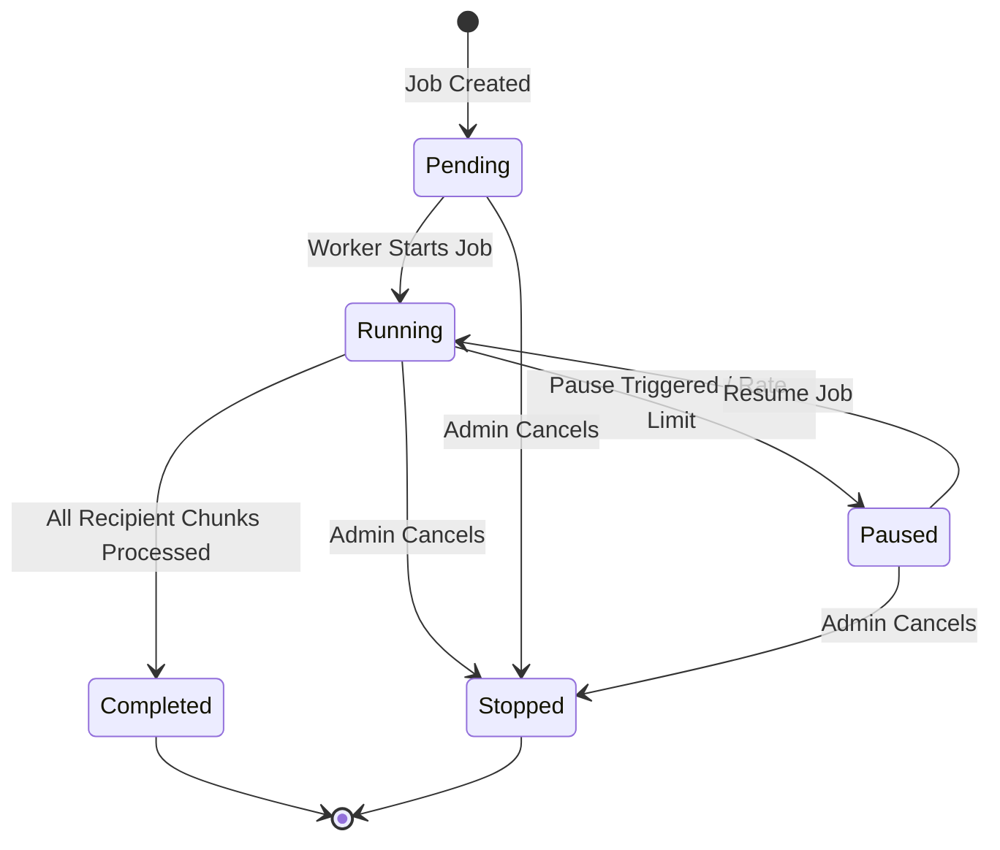

# grammY High-Performance Broadcast Pattern Reference

> **Target Version:** grammY `v1.46.0` & `v2.0.0-beta.x`  
> **Storage Targets:** Deno KV, Cloudflare Workers KV / Durable Objects, Redis / SQLite Key-Value  
> **Source:** Adapted Queue & Broadcast Architecture for KV-Backed Environments

---

## Table of Contents
- [1. Overview & Architecture](#1-overview--architecture)
- [2. Broadcast State Machine (Pending → Running → Paused/Stopped)](#2-broadcast-state-machine-pending--running--pausedstopped)
- [3. KV Storage Interface Shape](#3-kv-storage-interface-shape)
- [4. Chunked Sending & Auto-Throttle Rate Limiting](#4-chunked-sending--auto-throttle-rate-limiting)
- [5. Progress Tracking & Reporting System](#5-progress-tracking--reporting-system)
- [6. `setRestricted` Callback & User Status Maintenance](#6-setrestricted-callback--user-status-maintenance)
- [7. End-to-End Production Broadcast Worker Recipe](#7-end-to-end-production-broadcast-worker-recipe)

---

## 1. Overview & Architecture

Broadcasting messages to thousands or millions of Telegram users requires strict compliance with Telegram Bot API rate limits (30 messages per second across distinct users) and resilient background worker loops.

### Core Design Rules for Broadcasting:
1. **Never Broadcast in a Webhook Request Loop:** Broadcasting inside HTTP request handlers causes timeouts and Telegram webhook retries.
2. **Persistent Queue & State Machine:** Maintain broadcast progress state (`pending`, `running`, `paused`, `completed`, `stopped`) in atomic storage so jobs survive worker restarts.
3. **Chunked Dispatching:** Process recipients in small chunks (e.g. 25–30 users per tick) to maintain safe steady-state throughput.
4. **Adaptive Rate-Limit Throttling:** Instantly intercept Telegram `429 Too Many Requests` responses, extract `retry_after`, and delay execution automatically.
5. **Auto-Cleanup for Blocked Users:** Catch `403 Forbidden` ("bot was blocked by user") errors immediately to mark dead accounts in KV and avoid wasting future API quota.

---

## 2. Broadcast State Machine (Pending → Running → Paused/Stopped)

The broadcast engine operates as a deterministic state machine:



### State Enum & Type Definitions:

```typescript
export type BroadcastStatus = "pending" | "running" | "paused" | "completed" | "stopped";

export interface BroadcastJob<T = Record<string, unknown>> {
  id: string;
  status: BroadcastStatus;
  payload: BroadcastPayload;
  cursor: number;            // Current recipient index offset
  totalRecipients: number;
  successCount: number;
  failedCount: number;
  blockedCount: number;
  createdAt: number;
  updatedAt: number;
  completedAt?: number;
  error?: string;
  metadata?: T;
}

export type BroadcastPayload = 
  | { type: "text"; text: string; parse_mode?: "HTML" | "MarkdownV2"; reply_markup?: unknown }
  | { type: "photo"; photo: string; caption?: string; parse_mode?: "HTML" | "MarkdownV2"; reply_markup?: unknown }
  | { type: "copy_message"; from_chat_id: number | string; message_id: number };
```

---

## 3. KV Storage Interface Shape

Instead of hardcoding a specific database driver (like Redis or BullMQ), define a decoupled `BroadcastKVStorage` interface. This allows seamless integration with **Deno KV**, **Cloudflare Workers KV / Durable Objects**, **Vercel KV**, or **SQLite**.

```typescript
export interface BroadcastRecipient {
  userId: number | bigint;
  chatId?: number | bigint;
  isActive: boolean;
}

export interface BroadcastKVStorage {
  // Job Lifecycle
  createJob(payload: BroadcastPayload, recipientIds: (number | bigint)[]): Promise<string>;
  getJob(jobId: string): Promise<BroadcastJob | null>;
  updateJobStatus(jobId: string, status: BroadcastStatus): Promise<void>;
  
  // Recipient Fetching in Chunks
  getRecipientsChunk(jobId: string, cursor: number, limit: number): Promise<(number | bigint)[]>;
  
  // Progress Persistence
  updateJobProgress(
    jobId: string,
    progress: {
      cursor: number;
      successCount: number;
      failedCount: number;
      blockedCount: number;
    }
  ): Promise<void>;

  // User Status & Auto-Restricted Marking
  markUserRestricted(userId: number | bigint, reason: string): Promise<void>;
  isUserActive(userId: number | bigint): Promise<boolean>;
}
```

### Example Deno KV Adapter Implementation:

```typescript
export class DenoKVBroadcastStorage implements BroadcastKVStorage {
  constructor(private kv: Deno.Kv) {}

  async createJob(payload: BroadcastPayload, recipientIds: (number | bigint)[]): Promise<string> {
    const jobId = `job_${Date.now()}_${Math.random().toString(36).substring(2, 7)}`;
    const job: BroadcastJob = {
      id: jobId,
      status: "pending",
      payload,
      cursor: 0,
      totalRecipients: recipientIds.length,
      successCount: 0,
      failedCount: 0,
      blockedCount: 0,
      createdAt: Date.now(),
      updatedAt: Date.now(),
    };

    // Store Job Metadata
    await this.kv.set(["broadcast_jobs", jobId], job);

    // Store Recipient Chunks under jobId prefix
    const chunkSize = 100;
    for (let i = 0; i < recipientIds.length; i += chunkSize) {
      const chunk = recipientIds.slice(i, i + chunkSize);
      const chunkIndex = Math.floor(i / chunkSize);
      await this.kv.set(["broadcast_recipients", jobId, chunkIndex], chunk);
    }

    return jobId;
  }

  async getJob(jobId: string): Promise<BroadcastJob | null> {
    const res = await this.kv.get<BroadcastJob>(["broadcast_jobs", jobId]);
    return res.value;
  }

  async updateJobStatus(jobId: string, status: BroadcastStatus): Promise<void> {
    const job = await this.getJob(jobId);
    if (!job) return;
    job.status = status;
    job.updatedAt = Date.now();
    if (status === "completed" || status === "stopped") {
      job.completedAt = Date.now();
    }
    await this.kv.set(["broadcast_jobs", jobId], job);
  }

  async getRecipientsChunk(jobId: string, cursor: number, limit: number): Promise<(number | bigint)[]> {
    const chunkIndex = Math.floor(cursor / 100);
    const res = await this.kv.get<(number | bigint)[]>(["broadcast_recipients", jobId, chunkIndex]);
    if (!res.value) return [];
    
    const offsetInChunk = cursor % 100;
    return res.value.slice(offsetInChunk, offsetInChunk + limit);
  }

  async updateJobProgress(
    jobId: string, 
    progress: { cursor: number; successCount: number; failedCount: number; blockedCount: number }
  ): Promise<void> {
    const job = await this.getJob(jobId);
    if (!job) return;
    job.cursor = progress.cursor;
    job.successCount = progress.successCount;
    job.failedCount = progress.failedCount;
    job.blockedCount = progress.blockedCount;
    job.updatedAt = Date.now();
    await this.kv.set(["broadcast_jobs", jobId], job);
  }

  async markUserRestricted(userId: number | bigint, reason: string): Promise<void> {
    await this.kv.set(["users", userId.toString(), "restricted"], {
      restricted: true,
      reason,
      updatedAt: Date.now(),
    });
  }

  async isUserActive(userId: number | bigint): Promise<boolean> {
    const res = await this.kv.get<{ restricted: boolean }>(["users", userId.toString(), "restricted"]);
    return !res.value?.restricted;
  }
}
```

---

## 4. Chunked Sending & Auto-Throttle Rate Limiting

To avoid hitting Telegram's limits (30 msgs/sec overall, or 1 msg/sec in single groups), process messages in batch chunks with adaptive delay and error interception.

### Adaptive Throttle Loop Strategy:

```typescript
export interface BroadcastWorkerOptions {
  chunkSize?: number;          // Default: 25 recipients per batch
  delayBetweenChunksMs?: number; // Default: 1000ms (1 second)
  onUserRestricted?: (userId: number | bigint, reason: string) => Promise<void> | void;
  onProgress?: (progress: BroadcastProgressReport) => Promise<void> | void;
}

export class BroadcastQueueEngine {
  constructor(
    private api: any, // Bot API instance
    private storage: BroadcastKVStorage,
    private options: BroadcastWorkerOptions = {}
  ) {}

  async runJob(jobId: string): Promise<void> {
    let job = await this.storage.getJob(jobId);
    if (!job || job.status === "completed" || job.status === "stopped") return;

    // Transition to running
    await this.storage.updateJobStatus(jobId, "running");
    
    const chunkSize = this.options.chunkSize ?? 25;
    const delayMs = this.options.delayBetweenChunksMs ?? 1000;

    while (true) {
      // Re-check job status to respect external pause/stop triggers
      job = await this.storage.getJob(jobId);
      if (!job || job.status !== "running") break;

      if (job.cursor >= job.totalRecipients) {
        await this.storage.updateJobStatus(jobId, "completed");
        break;
      }

      // Fetch recipient chunk
      const recipients = await this.storage.getRecipientsChunk(jobId, job.cursor, chunkSize);
      if (recipients.length === 0) {
        await this.storage.updateJobStatus(jobId, "completed");
        break;
      }

      let chunkSuccess = 0;
      let chunkFailed = 0;
      let chunkBlocked = 0;

      for (const userId of recipients) {
        // Skip user if marked restricted
        const isActive = await this.storage.isUserActive(userId);
        if (!isActive) {
          chunkBlocked++;
          continue;
        }

        try {
          await this.dispatchMessage(userId, job.payload);
          chunkSuccess++;
        } catch (err: any) {
          // Handle Telegram Rate Limit (429 Too Many Requests)
          if (err.error_code === 429 || err.parameters?.retry_after) {
            const waitSeconds = err.parameters?.retry_after ?? 5;
            console.warn(`[Broadcast] Rate limited on job ${jobId}. Sleeping for ${waitSeconds}s`);
            
            // Auto-throttle: pause worker loop for requested duration
            await new Promise((r) => setTimeout(r, waitSeconds * 1000));
            
            // Retry the same recipient after sleeping
            try {
              await this.dispatchMessage(userId, job.payload);
              chunkSuccess++;
            } catch (retryErr: any) {
              chunkFailed++;
            }
          } 
          // Handle Blocked / Kicked / Deactivated User (403 Forbidden / 400 Bad Request)
          else if (this.isUserBlockedError(err)) {
            chunkBlocked++;
            const reason = err.description ?? "Forbidden: bot was blocked by the user";
            await this.storage.markUserRestricted(userId, reason);
            if (this.options.onUserRestricted) {
              await this.options.onUserRestricted(userId, reason);
            }
          } else {
            chunkFailed++;
          }
        }
      }

      // Update cursor & progress
      const newCursor = job.cursor + recipients.length;
      const newSuccess = job.successCount + chunkSuccess;
      const newFailed = job.failedCount + chunkFailed;
      const newBlocked = job.blockedCount + chunkBlocked;

      await this.storage.updateJobProgress(jobId, {
        cursor: newCursor,
        successCount: newSuccess,
        failedCount: newFailed,
        blockedCount: newBlocked,
      });

      // Emit progress event
      if (this.options.onProgress) {
        const elapsed = Date.now() - job.createdAt;
        const remaining = newCursor > 0 ? Math.round((elapsed / newCursor) * (job.totalRecipients - newCursor)) : 0;

        await this.options.onProgress({
          jobId,
          status: "running",
          total: job.totalRecipients,
          processed: newCursor,
          successful: newSuccess,
          failed: newFailed,
          blocked: newBlocked,
          percent: Math.min(100, Math.round((newCursor / job.totalRecipients) * 100)),
          elapsedMs: elapsed,
          estimatedRemainingMs: remaining,
        });
      }

      // Delay between chunk iterations to respect global 30 msg/sec
      await new Promise((r) => setTimeout(r, delayMs));
    }
  }

  private async dispatchMessage(targetId: number | bigint, payload: BroadcastPayload): Promise<void> {
    if (payload.type === "text") {
      await this.api.sendMessage(targetId, payload.text, {
        parse_mode: payload.parse_mode,
        reply_markup: payload.reply_markup,
      });
    } else if (payload.type === "photo") {
      await this.api.sendPhoto(targetId, payload.photo, {
        caption: payload.caption,
        parse_mode: payload.parse_mode,
        reply_markup: payload.reply_markup,
      });
    } else if (payload.type === "copy_message") {
      await this.api.copyMessage(targetId, payload.from_chat_id, payload.message_id);
    }
  }

  private isUserBlockedError(err: any): boolean {
    if (!err || typeof err !== "object") return false;
    const desc = (err.description ?? "").toLowerCase();
    const code = err.error_code;
    return (
      code === 403 ||
      desc.includes("bot was blocked by the user") ||
      desc.includes("user is deactivated") ||
      desc.includes("chat not found") ||
      desc.includes("can't initiate conversation")
    );
  }
}
```

---

## 5. Progress Tracking & Reporting Shape

Structured reporting guarantees admin visibility and accurate analytics throughout execution:

```typescript
export interface BroadcastProgressReport {
  jobId: string;
  status: BroadcastStatus;
  total: number;
  processed: number;
  successful: number;
  failed: number;
  blocked: number;
  percent: number;
  elapsedMs: number;
  estimatedRemainingMs: number;
}
```

### Live Telegram Admin Status Formatter:

```typescript
export function formatBroadcastStatus(report: BroadcastProgressReport): string {
  const progressBarLength = 10;
  const filled = Math.round((report.percent / 100) * progressBarLength);
  const bar = "▓".repeat(filled) + "░".repeat(progressBarLength - filled);
  
  const elapsedSec = Math.round(report.elapsedMs / 1000);
  const remainingSec = Math.round(report.estimatedRemainingMs / 1000);

  return (
    `<b>📢 Broadcast Status: ${report.status.toUpperCase()}</b>\n\n` +
    `Progress: [<code>${bar}</code>] <b>${report.percent}%</b>\n` +
    `Processed: <code>${report.processed}</code> / <code>${report.total}</code>\n` +
    `✅ Successful: <code>${report.successful}</code>\n` +
    `🚫 Blocked/Kicked: <code>${report.blocked}</code>\n` +
    `❌ Failed: <code>${report.failed}</code>\n\n` +
    `⏱ Elapsed: <code>${elapsedSec}s</code> | Est. Remaining: <code>${remainingSec}s</code>`
  );
}
```

---

## 6. `setRestricted` Callback & User Status Maintenance

When Telegram rejects a message due to user blocking or deletion, the worker triggers the `onUserRestricted` callback:

```typescript
const storage = new DenoKVBroadcastStorage(await Deno.openKv());

const queue = new BroadcastQueueEngine(bot.api, storage, {
  chunkSize: 25,
  delayBetweenChunksMs: 1000,

  // setRestricted callback pattern
  onUserRestricted: async (userId, reason) => {
    console.log(`[User Restricted] User ${userId} is dead: ${reason}`);
    
    // Automatically purge or flag user in master subscriber directory
    await storage.markUserRestricted(userId, reason);
  },

  // Live admin interface reporter
  onProgress: async (report) => {
    if (adminChatId) {
      await bot.api.editMessageText(
        adminChatId, 
        adminMessageId, 
        formatBroadcastStatus(report), 
        { parse_mode: "HTML" }
      ).catch(() => {});
    }
  },
});
```

---

## 7. End-to-End Production Broadcast Worker Recipe

Complete executable pattern combining KV storage, admin control commands (`/broadcast`, `/pause_broadcast`, `/resume_broadcast`, `/cancel_broadcast`), and worker execution:

```typescript
import { Bot, Context, Composer } from "grammy";
import { 
  BroadcastKVStorage, 
  BroadcastQueueEngine, 
  DenoKVBroadcastStorage, 
  formatBroadcastStatus 
} from "./broadcast-engine.js";

export const broadcastComposer = new Composer<Context>();

// Helper to check admin access
function isAdmin(ctx: Context): boolean {
  return ctx.from?.id === 123456789; // Replace with admin ID check
}

// 1. Trigger Broadcast Command
broadcastComposer.command("broadcast", async (ctx) => {
  if (!isAdmin(ctx)) return;

  const text = ctx.match;
  if (!text) {
    return ctx.reply("Usage: <code>/broadcast Your message text here</code>", { parse_mode: "HTML" });
  }

  const kv = await Deno.openKv();
  const storage = new DenoKVBroadcastStorage(kv);

  // Fetch all active recipient IDs from database
  const recipientIds = [10001, 10002, 10003, 10004]; // Example IDs array

  const jobId = await storage.createJob(
    { type: "text", text, parse_mode: "HTML" }, 
    recipientIds
  );

  const statusMsg = await ctx.reply(
    `🚀 <b>Broadcast Job Created!</b> ID: <code>${jobId}</code>\nTotal Recipients: ${recipientIds.length}`, 
    { parse_mode: "HTML" }
  );

  // Instantiate worker
  const engine = new BroadcastQueueEngine(ctx.api, storage, {
    chunkSize: 25,
    delayBetweenChunksMs: 1000,
    onProgress: async (report) => {
      await ctx.api.editMessageText(
        statusMsg.chat.id, 
        statusMsg.message_id, 
        formatBroadcastStatus(report), 
        { parse_mode: "HTML" }
      ).catch(() => {});
    },
    onUserRestricted: async (userId, reason) => {
      console.log(`Auto-restricted user ${userId}: ${reason}`);
    },
  });

  // Launch worker loop asynchronously without blocking webhook return
  engine.runJob(jobId).catch((err) => {
    console.error(`Broadcast job ${jobId} error:`, err);
  });
});

// 2. Pause Broadcast Command
broadcastComposer.command("pause_broadcast", async (ctx) => {
  if (!isAdmin(ctx)) return;
  const jobId = ctx.match;
  if (!jobId) return ctx.reply("Usage: /pause_broadcast <jobId>");

  const kv = await Deno.openKv();
  const storage = new DenoKVBroadcastStorage(kv);
  await storage.updateJobStatus(jobId, "paused");
  await ctx.reply(`⏸ Broadcast <code>${jobId}</code> paused.`, { parse_mode: "HTML" });
});

// 3. Resume Broadcast Command
broadcastComposer.command("resume_broadcast", async (ctx) => {
  if (!isAdmin(ctx)) return;
  const jobId = ctx.match;
  if (!jobId) return ctx.reply("Usage: /resume_broadcast <jobId>");

  const kv = await Deno.openKv();
  const storage = new DenoKVBroadcastStorage(kv);
  
  const engine = new BroadcastQueueEngine(ctx.api, storage, { chunkSize: 25 });
  engine.runJob(jobId).catch(console.error);

  await ctx.reply(`▶️ Broadcast <code>${jobId}</code> resumed.`, { parse_mode: "HTML" });
});
```
