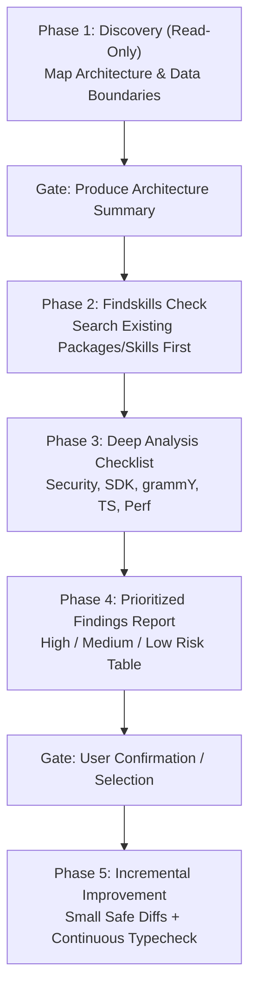

# Telegram Mini App (TMA) Codebase Analysis & Improvement Reference

> **Target Version:** grammY `v1.46.0` & `v2.0.0-beta.x` with Telegram Mini App (Bot API 6.0–10.3+)  
> **Runtimes:** Cloudflare Workers, Deno Deploy, Supabase Functions, Node.js VPS  
> **Frontend:** Vite, React, Vue, Svelte, or Vanilla TypeScript with `@telegram-apps/sdk` / `Telegram.WebApp`  
> **Scope:** Multi-Phase Agentic Codebase Audit, Security (initData HMAC), SDK Lifecycle, Serverless grammY Alignment, and Safe Execution Protocol

---

## Table of Contents
- [Workflow Overview](#workflow-overview)
- [Phase 1 — Discovery (Read-Only)](#phase-1--discovery-read-only)
- [Phase 2 — Findskills & Package Check](#phase-2--findskills--package-check)
- [Phase 3 — Analysis Checklist](#phase-3--analysis-checklist)
  - [1. Security & initData Validation](#1-security--initdata-validation)
  - [2. Telegram WebApp SDK Lifecycle & UI Usage](#2-telegram-webapp-sdk-lifecycle--ui-usage)
  - [3. grammY-Side Patterns & Serverless Architecture](#3-grammy-side-patterns--serverless-architecture)
  - [4. TypeScript Strict Compliance & Data Contracts](#4-typescript-strict-compliance--data-contracts)
  - [5. Performance & Mobile UX](#5-performance--mobile-ux)
- [Phase 4 — Findings Report & Action Gate](#phase-4--findings-report--action-gate)
- [Phase 5 — Improvement Execution Protocol](#phase-5--improvement-execution-protocol)

---

## Workflow Overview

When tasked with auditing, analyzing, or refactoring an existing Telegram Mini App (TMA) + grammY repository, execute this structured 5-phase protocol. Each phase acts as a distinct gate: **never modify code during discovery or analysis.**



---

## Phase 1 — Discovery (Read-Only)

Before touching or editing any files, inspect the project structure, dependencies, and configuration to build an accurate mental model.

### 1. Map Entry Points & Wiring
- **Bot Process Entry:** Locate `src/index.ts`, `src/bot/index.ts`, or `bot.ts`. Identify whether it runs in **Long Polling** (`bot.start()`, `runner`) or **Webhooks** (`webhookCallback`, Hono/Express handler).
- **Mini App Frontend Entry:** Locate `index.html`, `src/main.tsx`, `src/App.tsx`, or equivalent.
- **Bot ↔ Mini App Connection:**
  - `InlineKeyboardButton` with `web_app: { url }`
  - `KeyboardButton` with `web_app: { url }`
  - Menu button configured via `setChatMenuButton`
  - Direct deep links (`https://t.me/bot?startapp=...`)

### 2. Map Framework Versions & Plugins
- **grammY version:** Check `package.json` for `grammy` (`v1.x`) or JSR `@grammyjs/grammy` (`v2.x`).
- **Plugins in use:** Identify `@grammyjs/conversations`, `@grammyjs/menu`, `@grammyjs/runner`, `@grammyjs/session`, `@grammyjs/storage-*`, `@grammyjs/parse-mode`, `@grammyjs/types`.
- **Deployment target:** Determine runtime constraints: Cloudflare Workers, Deno Deploy, Supabase Functions, or Node.js (see [`serverless-patterns.md`](serverless-patterns.md) & [`hosting.md`](hosting.md)).

### 3. Map Frontend Stack & Communication Protocol
- Frontend UI library (React / Vite, Vue, Svelte, or Vanilla TS).
- Mini App SDK in use (`@telegram-apps/sdk`, `@twa-dev/sdk`, or raw `window.Telegram.WebApp`).
- Backend communication mechanism:
  - Direct Bot API calls via client? *(Flag for inspection in Phase 3)*
  - Custom REST/RPC backend (e.g. Hono, Fastify, Express)?
  - Shared serverless endpoint handling both Telegram webhooks and Mini App API requests?

### 4. Map Auth & Session Boundary
- How is the user identified when opening the Mini App?
- Is `initData` passed via HTTP headers (e.g. `Authorization: tma <initData>`) or query params?
- Where is session state stored (client local storage, bot session store, or backend DB)?

### 🚩 Phase 1 Gate Output
Produce a concise **Architecture Summary** before proceeding:
```text
=== Mini App Architecture Summary ===
- Runtime: [Cloudflare Workers / Deno / Node.js]
- grammY Version: [v1.46.0 / v2.0.0-beta.x]
- Update Mode: [Webhook / Long Polling]
- Frontend Stack: [Vite + React / etc.]
- TMA SDK: [@telegram-apps/sdk / window.Telegram.WebApp]
- API Boundary: [Combined Hono API / Separate backend / Pure Bot API]
- Auth Strategy: [HMAC initData header / none]
=====================================
```

---

## Phase 2 — Findskills & Package Check

Before proposing any new dependency, custom cryptographic routine, or state machine:

1. **Check Skill Library & Workspace:** Check `SKILL.md` Section 1 and `references/` for existing verified patterns:
   - For serverless KV & Hono patterns: See [`references/serverless-patterns.md`](serverless-patterns.md).
   - For strict TypeScript boundaries & DI: See [`references/typescript-patterns.md`](references/typescript-patterns.md).
   - For queue / broadcast state machines: See [`references/broadcast.md`](references/broadcast.md).
   - For session adapters: See [`references/sessions.md`](references/sessions.md).
2. **Check Runtime Compatibility:** Verify any suggested package has zero incompatible native Node dependencies (`fs`, `net`, `tls`, `crypto` C++ addons) if running on Cloudflare Workers / Deno Deploy.
3. **Pre-flight Dependency Check:** If proposing an external package, verify its freshness and exports before advising installation:
   ```bash
   npm view <package-name> version
   ```

---

## Phase 3 — Analysis Checklist

Walk through the codebase methodically against each category. Record all findings in standard format: `(File, Issue, Risk level, Suggested fix)`.

### 1. Security & initData Validation

#### 🚨 1.1 Server-Side `initData` HMAC Validation (High Risk)
- **Check:** Does the backend validate `Telegram.WebApp.initData` using HMAC-SHA256 with the bot token before trusting `user.id`, `user.username`, or granting permissions?
- **Anti-Pattern (Vulnerable):**
  ```typescript
  // ❌ CRITICAL: Blindly trusting client-provided unverified user data
  app.post("/api/user-data", (c) => {
    const { user } = c.req.json(); // Or reading initDataUnsafe directly
    return c.json({ balance: getBalance(user.id) });
  });
  ```
- **Recommended WebCrypto Pattern (Serverless & Node compatible):**
  ```typescript
  // ✅ Secure HMAC-SHA256 initData validation (Web Crypto API)
  export async function validateTelegramInitData(
    initData: string,
    botToken: string,
    maxAgeSeconds: number = 86400 // 24 hours
  ): Promise<{ valid: boolean; user?: TelegramUser; error?: string }> {
    const params = new URLSearchParams(initData);
    const hash = params.get("hash");
    if (!hash) return { valid: false, error: "Missing hash" };

    params.delete("hash");

    // Check auth_date freshness to prevent replay attacks
    const authDateStr = params.get("auth_date");
    if (!authDateStr) return { valid: false, error: "Missing auth_date" };
    const authDate = parseInt(authDateStr, 10);
    const now = Math.floor(Date.now() / 1000);
    if (now - authDate > maxAgeSeconds) {
      return { valid: false, error: "initData expired" };
    }

    // Sort parameters alphabetically
    const dataCheckString = Array.from(params.entries())
      .sort(([a], [b]) => a.localeCompare(b))
      .map(([k, v]) => `${k}=${v}`)
      .join("\n");

    const encoder = new TextEncoder();
    
    // HMAC-SHA256 with constant key "WebAppData"
    const secretKey = await crypto.subtle.importKey(
      "raw",
      encoder.encode("WebAppData"),
      { name: "HMAC", hash: "SHA-256" },
      false,
      ["sign"]
    );
    const secretHash = await crypto.subtle.sign(
      "HMAC",
      secretKey,
      encoder.encode(botToken)
    );

    // HMAC-SHA256 of dataCheckString using secretHash
    const dataKey = await crypto.subtle.importKey(
      "raw",
      secretHash,
      { name: "HMAC", hash: "SHA-256" },
      false,
      ["sign"]
    );
    const signature = await crypto.subtle.sign(
      "HMAC",
      dataKey,
      encoder.encode(dataCheckString)
    );

    const calculatedHash = Array.from(new Uint8Array(signature))
      .map((b) => b.toString(16).padStart(2, "0"))
      .join("");

    if (calculatedHash !== hash) {
      return { valid: false, error: "Hash mismatch" };
    }

    const userRaw = params.get("user");
    const user = userRaw ? (JSON.parse(userRaw) as TelegramUser) : undefined;
    return { valid: true, user };
  }
  ```

#### 🚨 1.2 Frontend Bot Token Leakage (High Risk)
- **Check:** Search the frontend source code and bundled environment variables for `BOT_TOKEN`, `VITE_BOT_TOKEN`, `REACT_APP_BOT_TOKEN`, or raw Telegram Bot token strings (`\d{8,10}:[A-Za-z0-9_-]{35}`).
- **Rule:** The bot token must **NEVER** exist in the frontend codebase or bundle. All Bot API calls requiring the token must occur server-side.

#### 🚨 1.3 Webhook Secret Token Verification (Medium Risk)
- **Check:** When using webhooks, verify that `X-Telegram-Bot-Api-Secret-Token` is validated via `webhookCallback(bot, adapter, { secretToken: process.env.BOT_SECRET_TOKEN })` (see [`references/deployment.md`](deployment.md)).

---

### 2. Telegram WebApp SDK Lifecycle & UI Usage

#### 2.1 Initialization & Viewport Sizing
- **Check:** Is `Telegram.WebApp.ready()` invoked during app initialization?
- **Check:** Is `Telegram.WebApp.expand()` called if the app requires full viewport height?
- **Viewport Handling:** Inspect CSS/layout logic. Ensure the app uses `Telegram.WebApp.viewportStableHeight` or CSS variables `--tg-viewport-height`, `--tg-viewport-stable-height` and safe area insets (`--tg-safe-area-inset-top`, `--tg-safe-area-inset-bottom`) to avoid visual clipping on mobile devices with dynamic address bars or notches.

#### 2.2 MainButton & BackButton State Management
- **Check:** Are button click listeners properly cleaned up when components unmount or routes change?
- **Anti-Pattern (Memory Leak / Multiple Triggers):**
  ```typescript
  // ❌ Leaks listeners on every navigation / re-render
  useEffect(() => {
    window.Telegram.WebApp.MainButton.setText("Submit");
    window.Telegram.WebApp.MainButton.show();
    window.Telegram.WebApp.MainButton.onClick(handleSubmit);
    // Missing cleanup!
  }, [handleSubmit]);
  ```
- **Recommended Cleanup Pattern:**
  ```typescript
  // ✅ Correct listener cleanup
  useEffect(() => {
    const webApp = window.Telegram.WebApp;
    webApp.MainButton.setText("Submit");
    webApp.MainButton.show();
    webApp.MainButton.onClick(handleSubmit);

    return () => {
      webApp.MainButton.offClick(handleSubmit);
      webApp.MainButton.hide();
    };
  }, [handleSubmit]);
  ```
- **BackButton Integration:** Show `BackButton` on inner views/routes, bind it to router back history, and call `BackButton.hide()` when returning to the root screen.

#### 2.3 Theme & Haptic Feedback
- **Theme Integration:** Does the UI adapt to Telegram color scheme changes (`themeParams`, `themeChanged` event) or bind to standard Telegram CSS variables (`--tg-theme-bg-color`, `--tg-theme-text-color`, `--tg-theme-button-color`)?
- **Haptic Feedback:** Are tactile feedback triggers (`HapticFeedback.impactOccurred("light" | "medium")`, `selectionChanged()`, `notificationOccurred("success" | "error")`) used appropriately for button taps and state transitions without spamming calls?

#### 2.4 Closing & Unsaved State Protection
- **Check:** Does the app call `Telegram.WebApp.enableClosingConfirmation()` when the user has unsaved state or an ongoing operation, and disable it once persisted?

---

### 3. grammY-Side Patterns & Serverless Architecture

#### 3.1 Session Storage Alignment
- **Check:** If deployed to Cloudflare Workers, Deno Deploy, or Vercel, ensure the bot is **not** using in-memory `session()` storage.
- **Rule:** Stateless serverless environments discard memory between requests. Use persistent KV/DB storage adapters (`@grammyjs/storage-supabase`, Upstash Redis REST, Cloudflare KV) as documented in [`references/sessions.md`](sessions.md) and [`references/serverless-patterns.md`](serverless-patterns.md).

#### 3.2 Conversation & Menu Plugin Survival
- **Check:** Are multi-step `@grammyjs/conversations` or `@grammyjs/menu` instances configured with externalized I/O and replay protection (`conversation.external`)?
- **Check:** Ensure long-polling runners (`@grammyjs/runner`) are **not** combined with serverless worker environments.

#### 3.3 Global Error Catching & Resilience
- **Check:** Is a global `bot.catch()` registered?
- **Check:** Does it differentiate `GrammyError` (API errors with `error_code`, `description`) from `HttpError` (network failures) and generic exceptions (see [`references/error-handling.md`](error-handling.md))?

---

### 4. TypeScript Strict Compliance & Data Contracts

#### 4.1 Strict Compiler Settings
- **Check:** Verify `tsconfig.json` adheres to strict settings (`strict: true`, `noImplicitAny: true`, `strictNullChecks: true`, `noUncheckedIndexedAccess: true`) per [`references/typescript-patterns.md`](typescript-patterns.md).

#### 4.2 Type Contracts Between Bot & Mini App
- **Check:** Are API request payloads, query parameters, and `initData` user objects typed explicitly instead of using `any` or loose `Record<string, any>`?
- **Pattern:**
  ```typescript
  export interface TelegramUser {
    id: number;
    first_name: string;
    last_name?: string;
    username?: string;
    language_code?: string;
    is_premium?: boolean;
    allows_write_to_pm?: boolean;
    photo_url?: string;
  }
  ```

---

### 5. Performance & Mobile UX

#### 5.1 Bundle Size & Cold Start Optimization
- **Frontend:** Are heavy UI libraries or dependencies bundled efficiently? Is code-splitting (dynamic `import()`) used for non-essential routes?
- **Backend:** Are heavy Node-only packages tree-shaken or eliminated for fast edge cold starts (< 50ms)?

#### 5.2 Redundant API Round-trips
- **Check:** Is the Mini App making redundant API calls back to the bot/backend on every render?
- **Rule:** Cache user profile and static configuration during app bootstrap using `initData` or a single initial hydrate endpoint.

---

## Phase 4 — Findings Report & Action Gate

Prioritize findings into **High**, **Medium**, and **Low** risk categories. Present them in a structured table before making any code modifications.

### Report Template

| Severity | File / Location | Issue Description | Proposed Fix |
| :--- | :--- | :--- | :--- |
| **HIGH** | `src/api/auth.ts:15` | `initData` parsed without HMAC-SHA256 validation; trusts `user_id` from client. | Implement WebCrypto HMAC verification function against `BOT_TOKEN`. |
| **HIGH** | `src/client/config.ts:4` | `VITE_BOT_TOKEN` exposed in client build environment. | Remove bot token from client; proxy Bot API calls through backend. |
| **MED** | `src/client/views/Checkout.tsx:28` | `MainButton.onClick` listener registered without cleanup in `useEffect`. | Add cleanup function calling `MainButton.offClick` and `MainButton.hide`. |
| **MED** | `src/bot/index.ts:18` | In-memory session store used on Cloudflare Workers runtime. | Switch to Cloudflare KV or Supabase storage adapter via `@grammyjs/storage-*`. |
| **LOW** | `src/client/App.tsx:12` | Viewport clipping on iOS due to hardcoded `100vh`. | Replace with `var(--tg-viewport-stable-height, 100vh)` and `safeAreaInset`. |

### 🚩 Phase 4 Gate: User Confirmation
> Present the report to the user and request explicit confirmation:
> *"I have completed the analysis. Please review the findings above. Which items would you like me to proceed with fixing (e.g. all High items, all items, or specific rows)?"*

---

## Phase 5 — Improvement Execution Protocol

Once the user approves the remediation plan, execute fixes following these strict rules:

1. **One Item at a Time (Smallest Safe Diff):**
   - Apply fixes sequentially starting with **High** severity issues.
   - Keep edits minimal, focused, and free of extraneous refactoring.
2. **Continuous Typecheck & Validation:**
   - Run typechecking (e.g. `npx tsc --noEmit` or runtime equivalent) after each file change.
   - Never batch unrelated fixes across multiple features into a single diff.
3. **Security-Sensitive Disclosure:**
   - For changes touching `initData` validation, token handling, webhook signatures, or session boundaries, summarize exactly what was changed and how the security invariant is now enforced.
4. **Preserve & Align Tests:**
   - If a test suite already exists (Vitest, Jest, Deno test), run and update tests to cover modified endpoints.
   - Do not introduce a new testing framework without checking existing workspace setup first.
