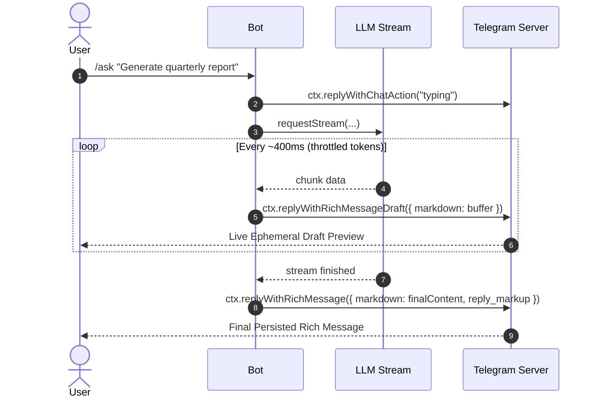

# grammY Rich Messages, Native Markdown & Keyboards Reference

> **Verified Version:** grammY `v1.45.1`  
> **Source:** `https://grammy.dev/ref/core/context#replywithrichmessage`, `https://grammy.dev/ref/core/context#replywithrichmessagedraft`, `https://grammy.dev/ref/core/api#sendrichmessage`, `https://grammy.dev/ref/core/api#sendrichmessagedraft`, `https://grammy.dev/guide/basics`, `https://grammy.dev/plugins/keyboard`

---

## Table of Contents
- [1. Architectural Overview & Comparison](#1-architectural-overview--comparison)
- [2. Native Rich Messages (`replyWithRichMessage` / `sendRichMessage`)](#2-native-rich-messages-replywithrichmessage--sendrichmessage)
  - [Method Signature & Context Shortcuts](#method-signature--context-shortcuts)
  - [Supported Options & Parameters](#supported-options--parameters)
  - [Supported Markdown Syntax (Tables, LaTeX Math, Expandables)](#supported-markdown-syntax-tables-latex-math-expandables)
  - [Media Permission Requirements](#media-permission-requirements)
- [3. Streaming Ephemeral Drafts (`replyWithRichMessageDraft` / `sendRichMessageDraft`)](#3-streaming-ephemeral-drafts-replywithrichmessagedraft--sendrichmessagedraft)
  - [Ephemeral 30-Second Preview Window](#ephemeral-30-second-preview-window)
  - [Stream-to-Persist Lifecycle Pattern](#stream-to-persist-lifecycle-pattern)
  - [Throttling Best Practices](#throttling-best-practices)
- [4. Standard HTML Formatting & Parse Modes](#4-standard-html-formatting--parse-modes)
  - [Supported HTML Tags](#supported-html-tags)
  - [HTML Entity Escaping](#html-entity-escaping)
  - [Link Preview Control (`link_preview_options`)](#link-preview-control-link_preview_options)
- [5. Inline Keyboards (`InlineKeyboard`) & Callbacks](#5-inline-keyboards-inlinekeyboard--callbacks)
  - [Button Types & Layouts](#button-types--layouts)
  - [Clearing Loading Spinners with `answerCallbackQuery`](#clearing-loading-spinners-with-answercallbackquery)
- [6. Production Implementation Recipes](#6-production-implementation-recipes)
  - [Recipe A: AI Token Streaming with Rich Drafts & Final Persistence](#recipe-a-ai-token-streaming-with-rich-drafts--final-persistence)
  - [Recipe B: Real-Time Server Dashboard with Native Tables & Refresh Button](#recipe-b-real-time-server-dashboard-with-native-tables--refresh-button)
  - [Recipe C: Dynamic `/rich` Command Handler with Safe Error Boundaries](#recipe-c-dynamic-rich-command-handler-with-safe-error-boundaries)
  - [Recipe D: Monospace Fallback for Standard `sendMessage`](#recipe-d-monospace-fallback-for-standard-sendmessage)

---

## 1. Architectural Overview & Comparison

Telegram and grammY provide two distinct methods for sending structured text to users:

| Feature | Classic `reply` (`sendMessage`) | Native `replyWithRichMessage` (`sendRichMessage`) | Streaming `replyWithRichMessageDraft` (`sendRichMessageDraft`) |
| :--- | :--- | :--- | :--- |
| **Primary Method** | `ctx.reply(text, options)` | `ctx.replyWithRichMessage(options)` | `ctx.replyWithRichMessageDraft(options)` |
| **API Direct Method** | `ctx.api.sendMessage(chat_id, text, opts)` | `ctx.api.sendRichMessage(chat_id, opts)` | `ctx.api.sendRichMessageDraft(chat_id, opts)` |
| **Max Character Limit**| 4,096 characters | **32,768 characters** | **32,768 characters** |
| **Markdown Tables (`\|---\|`)** | ❌ Monospace `<pre>` required | ✅ **Native visual table rendering** | ✅ **Native visual table rendering** |
| **Mathematical Formulas (LaTeX)** | ❌ Plain text only | ✅ **Native LaTeX `$..$` & `$$..$$`** | ✅ **Native LaTeX `$..$` & `$$..$$`** |
| **Persistence** | Permanent message in chat | Permanent message in chat | **Ephemeral (30s preview only)** |
| **Primary Use Case** | Basic notifications & text replies | Dashboards, rich reports, math, tables | Real-time AI / LLM token streaming |

---

## 2. Native Rich Messages (`replyWithRichMessage` / `sendRichMessage`)

`replyWithRichMessage` is a context-aware shortcut installed on `Context` for `ctx.api.sendRichMessage`. It automatically injects the current chat ID (`ctx.chat.id`).

### Method Signature & Context Shortcuts

```typescript
// grammY 1.x Context shortcut:
await ctx.replyWithRichMessage(other?: Other<"sendRichMessage", "chat_id">, signal?: AbortSignal): Promise<Message>;

// grammY 2.0 Context shortcut:
await ctx.sendRichMessage(other?: Other<"sendRichMessage", "chat_id">, signal?: AbortSignal): Promise<Message>;

// Direct API call (both 1.x and 2.0 via bot.api or ctx.api):
await bot.api.sendRichMessage(chat_id: number | string, other: Other<"sendRichMessage", "chat_id">, signal?: AbortSignal): Promise<Message>;
```

### Supported Options & Parameters

The options object passed to `replyWithRichMessage` supports:

```typescript
interface SendRichMessageOptions {
  /** The unescaped raw Markdown text formatted with rich features */
  markdown: string;
  
  /** Attached inline keyboard or reply markup */
  reply_markup?: InlineKeyboard | ReplyKeyboardMarkup | ReplyKeyboardRemove | ForceReply;
  
  /** Quoting / replying to existing messages */
  reply_parameters?: {
    message_id: number;
    chat_id?: number | string;
    allow_sending_without_reply?: boolean;
    quote?: string;
    quote_parse_mode?: string;
  };
  
  /** Forum topic thread ID */
  message_thread_id?: number;
  
  /** Send silently without notification sound */
  disable_notification?: boolean;
  
  /** Protect message from forwarding and saving */
  protect_content?: boolean;
  
  /** Telegram Business connection ID */
  business_connection_id?: string;
}
```

### Supported Markdown Syntax (Tables, LaTeX Math, Expandables)

Unlike legacy `parse_mode: "MarkdownV2"` which requires meticulous backslash escaping for all punctuation, `replyWithRichMessage` accepts standard Markdown directly:

#### 1. Markdown Tables
```markdown
| Service | Status | Latency |
|:---|:---:|---:|
| API Gateway | 🟢 Up | 12ms |
| PostgreSQL | 🟢 Up | 2ms |
| Redis Cache | 🟡 Warm | 18ms |
```

#### 2. Mathematical Equations (LaTeX)
- **Inline formula:** `$E = mc^2$` or `$\sigma = \sqrt{\frac{1}{N}\sum_{i=1}^N (x_i - \mu)^2}$`
- **Block formula:**
  ```latex
  $$
  f(x) = \int_{-\infty}^{\infty} \hat{f}(\xi)\,e^{2 \pi i \xi x}\,d\xi
  $$
  ```

#### 3. Expandable Blockquotes & Collapsible Sections
```markdown
**> Collapsible Changelog**
> - Feature 1: Added native rich message support
> - Feature 2: Added ephemeral draft streaming
> - Fix: Resolved markdown table rendering issues
```

#### 4. Spoilers, Strikethrough, Code Blocks
```markdown
||Secret spoiler text||
~~Strikethrough text~~
```ts
const greeting = "Hello, world!";
```
```

### Media Permission Requirements

> [!IMPORTANT]
> If a rich message contains a block with an embedded media element, the bot **must have permission** to send that specific media type (photos, documents, etc.) in the destination chat or group.

---

## 3. Streaming Ephemeral Drafts (`replyWithRichMessageDraft` / `sendRichMessageDraft`)

`replyWithRichMessageDraft` is a context-aware shortcut for `api.sendRichMessageDraft`.

### Ephemeral 30-Second Preview Window

- **Drafts are NOT saved permanently:** Draft messages act as a temporary 30-second live preview in the Telegram client.
- If the bot stops updating the draft and never calls `replyWithRichMessage`, the draft vanishes after its expiration window.
- **Persistence Rule:** Once streaming finishes, you **must call `replyWithRichMessage`** to save the final message permanently in the user's chat.

### Stream-to-Persist Lifecycle Pattern



### Throttling Best Practices

Do NOT send a draft call for every single token received from an AI model. Telegram rate limits draft updates. Throttle draft calls to every **300ms–500ms**:

```typescript
let lastDraftTime = 0;
const DRAFT_INTERVAL_MS = 400;

async function onTokenChunk(chunk: string, currentBuffer: string, ctx: MyContext) {
  const now = Date.now();
  if (now - lastDraftTime > DRAFT_INTERVAL_MS) {
    lastDraftTime = now;
    await ctx.replyWithRichMessageDraft({
      markdown: currentBuffer,
    });
  }
}
```

---

## 4. Standard HTML Formatting & Parse Modes

When not using `replyWithRichMessage`, the standard `ctx.reply` with `parse_mode: "HTML"` remains the recommended approach for standard formatted messages under 4,096 characters.

### Supported HTML Tags

| Tag | Purpose | Example |
| :--- | :--- | :--- |
| `<b>`, `<strong>` | Bold header or emphasized text | `<b>Important Update</b>` |
| `<i>`, `<em>` | Italicized subtitle or caption | `<i>Generated at 10:00 UTC</i>` |
| `<u>`, `<ins>` | Underlined text | `<u>Underlined Notice</u>` |
| `<s>`, `<strike>`, `<del>` | Strikethrough | `<s>Old price: $50</s>` |
| `<tg-spoiler>` | Concealed spoiler content | `<tg-spoiler>Secret code: 4829</tg-spoiler>` |
| `<a href="...">` | Embedded inline hyperlink | `<a href="https://grammy.dev">grammY Docs</a>` |
| `<code>` | Monospace code snippet | `<code>const token = "..."</code>` |
| `<pre>` | Multi-line code block | `<pre><code class="language-typescript">console.log("hi");</code></pre>` |
| `<blockquote>` | Quoted text block | `<blockquote>Quoted block</blockquote>` |
| `<blockquote expandable>` | Collapsible / expandable quote | `<blockquote expandable>Long changelog...</blockquote>` |

### HTML Entity Escaping

Always escape dynamic or user-generated text when using HTML mode:

```typescript
export function escapeHtml(text: string): string {
  return text
    .replace(/&/g, "&amp;")
    .replace(/</g, "&lt;")
    .replace(/>/g, "&gt;");
}
```

### Link Preview Control (`link_preview_options`)

```typescript
await ctx.reply(`Check our guide: <a href="https://grammy.dev">grammY Documentation</a>`, {
  parse_mode: "HTML",
  link_preview_options: {
    is_disabled: false,        // false = show preview, true = hide preview
    prefer_small_media: true,  // Compact thumbnail preview
    show_above_text: false,    // Preview below text
  },
});
```

---

## 5. Inline Keyboards (`InlineKeyboard`) & Callbacks

### Button Types & Layouts

`InlineKeyboard` can be directly attached to both `ctx.replyWithRichMessage({ reply_markup })` and `ctx.reply(text, { reply_markup })`:

```typescript
import { InlineKeyboard } from "grammy";

const keyboard = new InlineKeyboard()
  // URL Button: Opens link
  .url("📖 Documentation", "https://grammy.dev")
  // Callback Button: Triggers bot listener
  .text("🔄 Refresh Data", "stats:refresh")
  .row()
  // Mini App Button
  .webApp("🚀 Launch App", "https://app.example.com")
  // Clipboard Copy Button
  .copyText("📋 Copy Token", "AUTH_KEY_9921");
```

### Clearing Loading Spinners with `answerCallbackQuery`

> [!IMPORTANT]
> Always call `await ctx.answerCallbackQuery()` inside `bot.callbackQuery` or `composer.callbackQuery` handlers immediately to dismiss the user's client loading indicator.

```typescript
composer.callbackQuery("stats:refresh", async (ctx) => {
  await ctx.answerCallbackQuery({
    text: "Statistics refreshed!",
    show_alert: false, // true = modal popup; false = toast banner
  });

  // Re-generate stats and update
  const newMarkdown = generateStatsMarkdown();
  await ctx.replyWithRichMessage({
    markdown: newMarkdown,
    reply_markup: createStatsKeyboard(),
  });
});
```

---

## 6. Production Implementation Recipes

### Recipe A: AI Token Streaming with Rich Drafts & Final Persistence

```typescript
import { Composer, Context, InlineKeyboard } from "grammy";

export type MyContext = Context;
export const aiFeature = new Composer<MyContext>();

aiFeature.command("ask", async (ctx) => {
  const prompt = ctx.match;
  if (!prompt) {
    return ctx.reply("Please provide a prompt. Example: <code>/ask explain quantum computing</code>", {
      parse_mode: "HTML",
    });
  }

  // 1. Initial chat action
  await ctx.replyWithChatAction("typing");

  let accumulatedMarkdown = "";
  let lastDraftTimestamp = 0;
  const DRAFT_THROTTLE_MS = 400;

  try {
    // 2. Stream tokens from AI model (mock stream example)
    const stream = fakeAiStream(prompt);

    for await (const token of stream) {
      accumulatedMarkdown += token;
      const now = Date.now();

      // 3. Stream ephemeral draft preview
      if (now - lastDraftTimestamp > DRAFT_THROTTLE_MS) {
        lastDraftTimestamp = now;
        await ctx.replyWithRichMessageDraft({
          markdown: accumulatedMarkdown,
        });
      }
    }

    // 4. Finalize and persist permanent rich message
    const actionKeyboard = new InlineKeyboard()
      .text("👍 Helpful", "ai:vote_up")
      .text("👎 Not Helpful", "ai:vote_down");

    await ctx.replyWithRichMessage({
      markdown: accumulatedMarkdown,
      reply_markup: actionKeyboard,
    });
  } catch (error) {
    console.error("AI stream error:", error);
    await ctx.reply("An error occurred while generating the response.", {
      parse_mode: "HTML",
    });
  }
});

// Mock generator for testing
async function* fakeAiStream(prompt: string) {
  const words = `### Response to: "${prompt}"\n\n| Step | Details |\n|---|---|\n| 1 | Query analyzed |\n| 2 | Solution synthesized |\n\nFormula: $$\\lim_{x \\to \\infty} \\frac{1}{x} = 0$$\n\nDone!`.split(" ");
  for (const word of words) {
    await new Promise((r) => setTimeout(r, 60));
    yield word + " ";
  }
}
```

### Recipe B: Real-Time Server Dashboard with Native Tables & Refresh Button

```typescript
import { Composer, Context, InlineKeyboard } from "grammy";

export type MyContext = Context;
export const dashboardFeature = new Composer<MyContext>();

function getDashboardMarkdown(): string {
  const timestamp = new Date().toISOString().replace("T", " ").substring(0, 19);
  const uptime = process.uptime().toFixed(0);
  const memory = (process.memoryUsage().heapUsed / 1024 / 1024).toFixed(1);

  return `# 🖥️ Server Infrastructure Dashboard

## System Status
| Component | Status | Latency | Uptime |
|:---|:---:|---:|---:|
| Webhook Gateway | 🟢 Online | 8ms | ${uptime}s |
| Redis Cache | 🟢 Connected | 1ms | Active |
| Database Primary | 🟢 Healthy | 3ms | Active |

## Resource Allocation
| Resource | Current | Limit | Utilization |
|:---|---:|---:|:---:|
| Heap Memory | ${memory} MB | 512 MB | 🟢 Normal |
| Worker Threads | 4 | 8 | 50% |

**Last Updated:** \`${timestamp} UTC\`
**Health:** 🟢 *All systems operational*`;
}

function getDashboardKeyboard(): InlineKeyboard {
  return new InlineKeyboard()
    .text("🔄 Refresh Live Stats", "dashboard:refresh")
    .url("📈 Grafana", "https://grafana.internal");
}

dashboardFeature.command("status", async (ctx) => {
  await ctx.replyWithRichMessage({
    markdown: getDashboardMarkdown(),
    reply_markup: getDashboardKeyboard(),
  });
});

dashboardFeature.callbackQuery("dashboard:refresh", async (ctx) => {
  await ctx.answerCallbackQuery({ text: "Dashboard metrics refreshed!" });

  await ctx.replyWithRichMessage({
    markdown: getDashboardMarkdown(),
    reply_markup: getDashboardKeyboard(),
  });
});
```

### Recipe C: Dynamic `/rich` Command Handler with Safe Error Boundaries

```typescript
import { Composer, Context, InlineKeyboard } from "grammy";

export type MyContext = Context;
export const richFeature = new Composer<MyContext>();

richFeature.command("rich")
  .filter(
    (ctx) => Boolean(ctx.match),
    async (ctx) => {
      const rawMarkdown = ctx.match!;

      try {
        await ctx.replyWithRichMessage({
          markdown: rawMarkdown,
          reply_markup: new InlineKeyboard().text("✨ Rendered via grammY", "noop"),
        });
      } catch (err) {
        // Fallback: If Telegram rejects markdown formatting, display error details
        const errorText = String(err);
        await ctx.reply(`Failed to render rich message:\n${errorText}`, {
          entities: [{
            offset: 0,
            length: `Failed to render rich message:\n${errorText}`.length,
            type: "pre",
            language: "text",
          }],
        });
      }
    },
  );

richFeature.callbackQuery("noop", async (ctx) => {
  await ctx.answerCallbackQuery();
});
```

### Recipe D: Monospace Fallback for Standard `sendMessage`

When constrained to standard `sendMessage` with `parse_mode: "HTML"`, render tables using monospace ASCII formatting:

```typescript
export function formatMonospaceTable(headers: string[], rows: string[][]): string {
  const colWidths = headers.map((h, i) =>
    Math.max(h.length, ...rows.map((r) => (r[i] ?? "").length))
  );

  const formatRow = (row: string[]) =>
    row.map((cell, i) => (cell ?? "").padEnd(colWidths[i])).join(" │ ");

  const separator = colWidths.map((w) => "─".repeat(w)).join("─┼─");

  return [
    "<pre>",
    formatRow(headers),
    separator,
    ...rows.map(formatRow),
    "</pre>",
  ].join("\n");
}
```
r in update ${err.ctx.update.update_id}:`, err.error);
});

bot.start();
```
